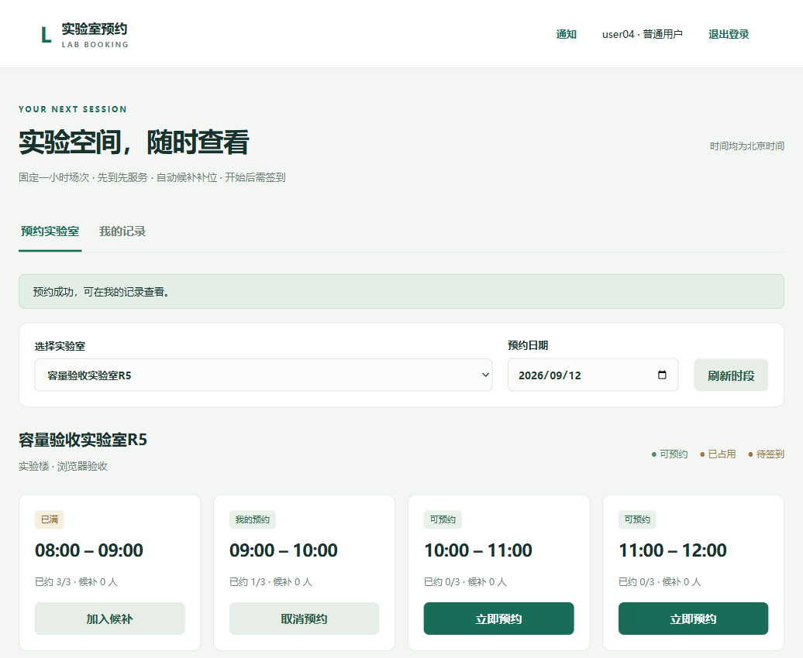
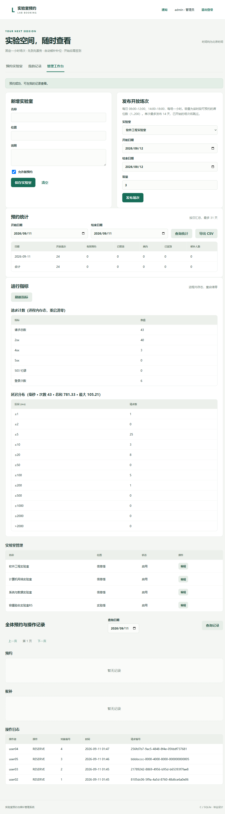

# 基于 C 语言的实验室预约与候补系统

[](https://github.com/yq6666-66/lab-booking-system/actions/workflows/ci.yml)


高校开放实验室预约与候补管理系统（软件工程毕业设计）。**C11 + CivetWeb + SQLite + cJSON + libsodium** 实现的 B/S 系统：固定一小时场次、容量制预约、FIFO 候补自动补位、限时签到与爽约回收、站内通知、请求去重与中断恢复。技术核心是**并发事务一致性、幂等请求去重、进程中断恢复验证**——全部结论由自动化实验实测支撑，详见[测试报告](docs/TEST_REPORT.md)。

## 功能特性

**预约与候补**
- 按实验室与日期查询开放场次，场次带容量（1..200 席位），界面实时显示"已约 X/Y"；
- 预约即时生效；满员可加入候补（FIFO），取消/爽约释放后**在同一事务内按顺序连续补位直至满员或队列空**；
- 尚有余位时候补请求被引导直接预约；候补者账号禁用自动跳过；
- 预约撞满时返回同实验室 7 天内最多 3 个空闲替代时段，页面一键改约。

**签到与爽约**
- 场次开始后进入签到窗口（`--checkin-window`，默认 15 分钟），仅本人可签到，同编号重放幂等；
- 超时未签到由服务端扫描线程（`--sweep-interval`，默认 30 秒）在单事务内标记爽约、释放名额并补位；
- 补位产生的预约以补位时刻为签到起点，避免刚补位即被回收。

**账号与安全**
- libsodium 密码哈希、随机令牌会话、CSRF + Origin + Host 三重校验、16KB 请求体上限；
- 自助改密（其他会话立即失效）、在线会话列表与强制下线、过期会话自动清理；
- 登录防爆破（默认 5 次失败锁定 900 秒）与写操作令牌桶限速（默认突发 30、每秒补 1），超限 429。

**管理与运维**
- 管理员维护实验室、按日期区间与容量批量发布场次（单次最多 14 天）；
- 逐日预约统计（开放/有效/取消/爽约/已签到/候补）与 CSV 导出（带 BOM、合计行）；
- 操作审计日志与请求回执：同编号同参数重放返回原结果、同编号换参数 409 冲突，网络失败可安全重试；
- 运行指标端点：请求计数、状态分类、忙碌次数、登录次数与毫秒级延迟直方图。

## 界面预览

| 预约与替代时段 | 管理工作台 |
| --- | --- |
|  |  |

更多截图见 [docs/evidence/ui-r3/](docs/evidence/ui-r3/) 与 [docs/evidence/ui-r5/](docs/evidence/ui-r5/)。

## 快速开始

环境要求：Windows x64、MinGW-w64 GCC（C11）、PowerShell；运行测试另需 Python 3.9+。

```powershell
# 1. 构建（vendor 依赖源码已入库，无需联网；自动运行 20 个单元测试）
powershell -File scripts/build.ps1
#    可选：powershell -File scripts/build.ps1 -Analyze  # gcc 静态分析
#    可选：powershell -File scripts/build.ps1 -Harden    # FORTIFY+SSP 加固构建

# 2. 一键启动演示服务（首次自动初始化演示库，监听 http://127.0.0.1:8080）
powershell -File scripts/start-demo.ps1 -Password 'Demo-Lab-2026'
#    -Reset 参数可清空旧演示数据重新开始
```

> 部署提示：可执行文件依赖同目录下的 `build/libsodium-26.dll`（构建脚本已就位）。
> 迁移到其他机器时请将 `lab-booking.exe`、`libsodium-26.dll` 与 `web/` 一起复制；
> `tests/install_test.ps1` 会按此清单在空目录完整演练一遍部署流程。

| 演示账号 | 说明 |
| --- | --- |
| `admin` | 管理员（实验室管理、场次发布、统计导出、运行指标） |
| `user01` ~ `user20` | 普通用户（预约/候补/签到/通知/改密/会话管理） |

密码均为初始化时 `-Password` 参数设定的值（上面示例为 `Demo-Lab-2026`）。

手工启动方式与全部命令行参数（签到窗口、扫描间隔、限流与防爆破阈值等）见 [docs/CONTRACT.md](docs/CONTRACT.md) 与 [README 运行章节](#快速开始)。

## 系统测试

```powershell
python tests/integration.py --quick --output tests/results-quick   # 快速回归（约 1 分钟）
python tests/integration.py --full  --output tests/results-full    # 完整实验（并发+故障注入）
python tests/benchmark.py --output docs/evidence/benchmark         # 性能基准实验
powershell -File scripts/build.ps1 -Harden                          # 加固构建后可复跑全量
```

最近一轮完整实验（29 项断言组）全部通过，亮点数据：

- **并发正确性**：1/5/10/20 并发 × 20 轮共 720 次争抢请求，每轮有效预约恰好 1 个（容量制下零超卖），其余全部收到明确 409；
- **中断恢复**：事务提交前/提交后两类故障注入各 10 次，重启后状态与重试行为全部正确；
- **签到爽约闭环**：超时回收、FIFO 补位、双向通知全链路验证；
- **静态保障**：`gcc -fanalyzer` 零告警 + 绑定参数类型静态核查；本机工具链无 ASan 运行库的限制与 FORTIFY+SSP 替代方案在报告中如实记录。

详细数据：[docs/TEST_REPORT.md](docs/TEST_REPORT.md) · 断言清单：[tests/README.md](tests/README.md) · CI 由 GitHub Actions 在每次推送时自动执行（构建 + 单元测试 + 快速集成 + 静态分析）。

## 系统架构

```
浏览器（原生 HTML/JS/CSS）
   │  JSON over HTTP（回环地址）
   ▼
CivetWeb HTTP 服务（多工作线程）
   │  会话认证 → CSRF/Origin/Host 校验 → 限流防爆破 → 请求计时
   ▼
业务层 src/service.c（事务、容量校验、FIFO 补位、去重回执、签到爽约、通知）
   │                    src/ratelimit.c（限流）  src/metrics.c（指标）
   ▼
数据访问 src/db.c（参数绑定、schema v3 幂等迁移、完整性检查）
   ▼
SQLite（WAL · synchronous=FULL · 外键 · 容量不变量）
```

## 文档

| 文档 | 内容 |
| --- | --- |
| [docs/CONTRACT.md](docs/CONTRACT.md) | 接口契约：端点、数据模型、事务与一致性规则、错误码 |
| [docs/TEST_REPORT.md](docs/TEST_REPORT.md) | 测试报告：实验设计、数据与结论 |
| [tests/README.md](tests/README.md) | 测试执行方法与断言范围 |
| [docs/PROGRESS.md](docs/PROGRESS.md) | 实施进度清单（五轮迭代） |
| [docs/CHANGELOG.md](docs/CHANGELOG.md) | 版本变更记录 |
| [docs/dependencies.lock.json](docs/dependencies.lock.json) | 第三方依赖版本与 SHA256 |
| [docs/evidence/](docs/evidence/) | 实验数据、基准结果、验收截图 |

## 目录结构

```
src/      C 源码（main / util / db / service / http / ratelimit / metrics）
web/      浏览器静态页面（原生 HTML/JS/CSS）
vendor/   第三方依赖源码与许可证（已入库，克隆即可构建）
scripts/  构建脚本、依赖获取（复现用）、演示启动脚本
tests/    集成与可靠性实验、单元测试、性能基准（Python 标准库）
docs/     契约、测试报告、进度、证据、课题与论文材料
data/     运行数据库（不入库）
```

## 第三方组件

| 组件 | 版本 | 许可证 | 用途 |
| --- | --- | --- | --- |
| [CivetWeb](https://github.com/civetweb/civetweb) | commit 588860e | MIT（详见 vendor/civetweb/LICENSE.md） | 嵌入式 HTTP 服务 |
| [SQLite](https://www.sqlite.org/) | 3.53.4 | Public Domain | 嵌入式数据库 |
| [cJSON](https://github.com/DaveGamble/cJSON) | 1.7.19 | MIT | JSON 解析 |
| [libsodium](https://libsodium.org/) | 1.0.22 | ISC | 密码哈希与安全随机数 |
| [Unity](https://github.com/ThrowTheSwitch/Unity) | 2.7.2 | MIT | 单元测试框架 |

固定版本与校验值见 [docs/dependencies.lock.json](docs/dependencies.lock.json)；对上游的一处兼容性修复记录于 [docs/UPSTREAM_PATCHES.md](docs/UPSTREAM_PATCHES.md)。

## 许可证

本项目代码以 [MIT License](LICENSE) 发布。第三方组件沿用其各自许可证（见上表），均已随源码附带许可证文本。
